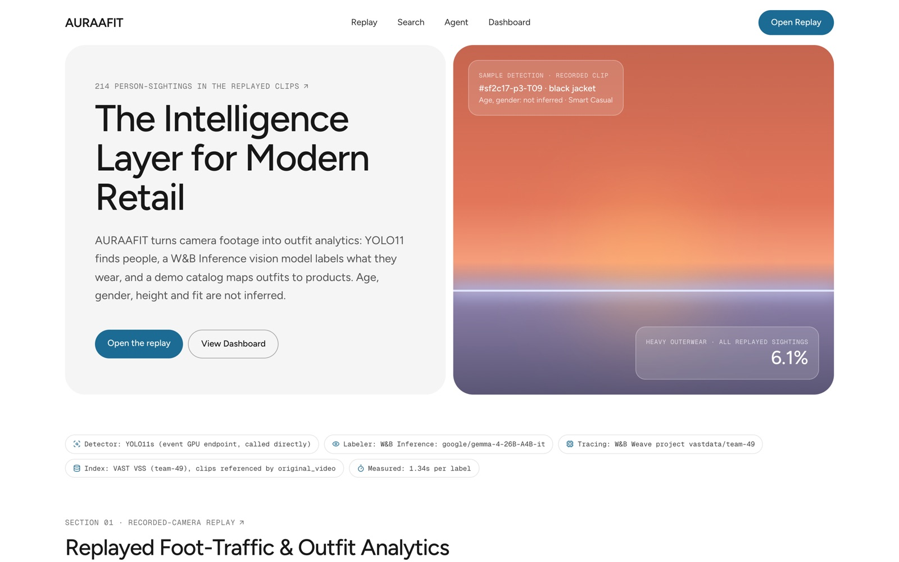
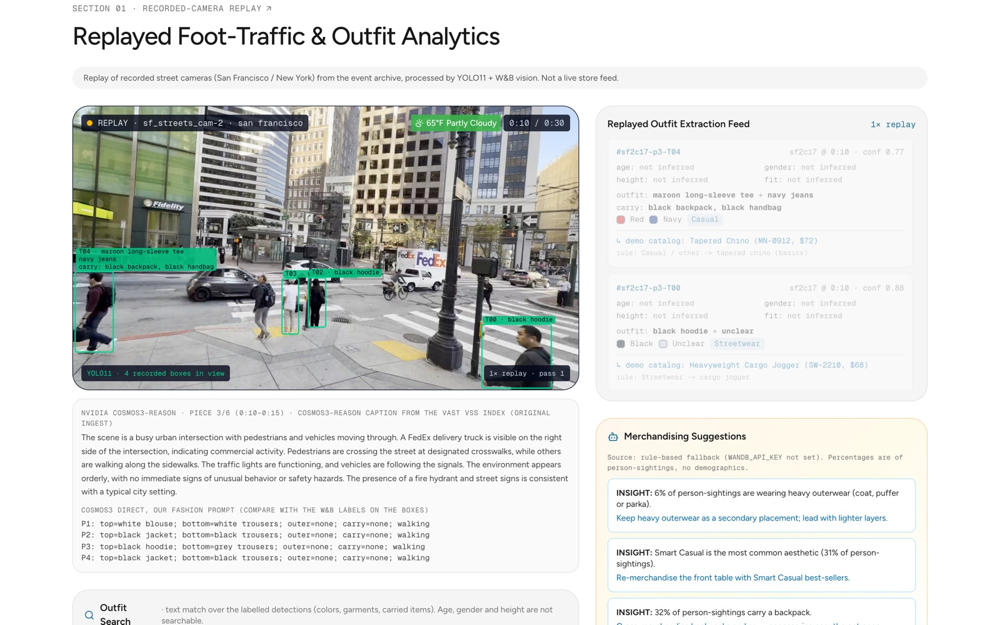
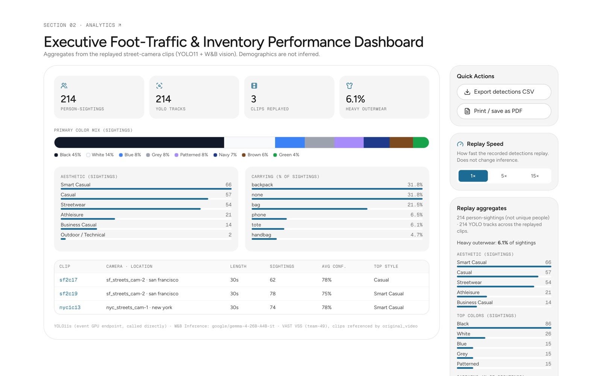

# AURAAFIT

**What the street is wearing, without knowing who's wearing it.**

AURAAFIT turns street-camera video into outfit analytics a merchandiser can act on: what people wear and carry, with a VAST clip and a W&B Weave trace behind every label, and without guessing who anyone is.

Built by Team 49 at the VAST Data Builders Challenge: Real-Time Video Agents Hack, NYC, October 9, 2026.

**Live site: [auraafit.tech](https://auraafit.tech)** · Demo video: [youtu.be/zCnlGEaNM_c](https://youtu.be/zCnlGEaNM_c) · App code: [`domain` branch](https://github.com/bofrompursuit/vastbuildersteam49/tree/domain)



## About

Stores count foot traffic, but they can't see what the street is wearing. AURAAFIT reads outfits from video.

It starts from event footage indexed in VAST VSS (612 clips, 13 cameras). NVIDIA YOLO11 finds and tracks each person, and W&B Inference vision (Gemma 4) labels what they wear and carry: top, bottom, outer layer, bags. Every labelling call is traced in W&B Weave. Requiring a real garment type in our prompt took typed labels from 49 to 213 out of 214. NVIDIA Cosmos3-Reason adds a scene caption for each 5-second piece.

The app at [auraafit.tech](https://auraafit.tech) replays recorded street cameras from San Francisco and New York with the labels on the boxes. Buyers can search the labels ("backpack"), and each match links to its clip and timestamp in VAST. A dashboard rolls up 214 person-sightings into colour mix, style mix and carried items, with CSV export. A merchandising agent reads only the totals and drafts store actions, such as putting carry accessories near the entrance because 32% of sightings carry a backpack.

Privacy by design: a guard filter keeps clothing and carried items only. Age, gender, race and faces are never inferred, and nothing is tracked across cameras. Counts are sightings, not unique people.

Built for retailers, landlords and business districts deciding what to stock or lease on a block. Next step: a consenting storefront camera, over repeated days.

## Try it

Open **[auraafit.tech](https://auraafit.tech)**. It works in any modern browser and needs no login.

1. **Replay:** click **Open the replay**. YOLO11 finds each person and follows them through the clip, and each box carries the outfit label from W&B Inference vision, for example "black jacket over black sweatshirt". The feed on the right turns every sighting into a structured row.
2. **Cosmos captions:** under the video is the NVIDIA Cosmos3-Reason scene caption for the 5-second piece that is playing, from our VAST VSS index. Below it is a direct Cosmos3 pass with our fashion prompt. Cosmos describes the scene; W&B labels each person.
3. **Outfit Search:** because the labels are structured, you can search them. Try "backpack" or "black jacket and jeans". Each match comes with its clip and timestamp in VAST: a receipt you can check against the footage.
4. **Merchandising Suggestions:** the agent reads the totals, never the raw video. For example, 32% of sightings carry a backpack, so it suggests putting carry accessories near the entrance.
5. **Dashboard:** 214 person-sightings across 3 clips, with colour mix, style mix, carried items and confidence for each clip. **Export detections CSV** downloads the raw rows.





## How it works

1. **Index:** the event footage is already indexed in VAST VSS (VastDB): 612 clips, 3,537 five-second segments, 13 cameras.
2. **Fetch:** clips come through the VSS stream API.
3. **Detect:** NVIDIA YOLO11 on the event GPU endpoint finds a box for each person.
4. **Label:** each person is cropped, and W&B Inference vision (Gemma 4, `google/gemma-4-26B-A4B-it`) names the garments and carried items.
5. **Trace:** every labelling call is traced in W&B Weave (`vastdata/team-49`): the exact crop the model saw, the prompt, and the answer. Our first prompt allowed colour-only answers like "black top". Requiring a real garment type took typed labels from 49 to 213 out of 214.
6. **Guard:** a filter keeps clothing and carried items only, and drops any age, gender, race, face or hair words.
7. **Serve:** the results feed the Next.js app, its charts, the search and the merchandising agent.

## Sponsor tools used

| Tool | What we used it for |
|---|---|
| **VAST VSS / VastDB** | Index of the event footage: captions, detections and vectors. Every number links to its source clip. |
| **NVIDIA Cosmos3-Reason** | Scene captions in the index, plus direct calls while iterating on our prompt (10+ versions). |
| **NVIDIA Cosmos Embed1** | Video vectors behind the index's semantic footage search. |
| **NVIDIA YOLO11** | Person detection on the event GPU endpoint. |
| **W&B Inference** (CoreWeave) | Gemma 4 vision model that labels each person crop; can also power the merchandising agent. |
| **W&B Weave** | Traces every labelling call: prompt version, image and answer. |

Also: Next.js, Tailwind CSS, Vercel, Cursor.

## Privacy and honest limits

- **Clothing and carried items only.** No demographics, no faces, and no tracking across cameras.
- **Counts are person-sightings, not unique people.** The same person can appear in several frames.
- **Labels are model output, not hand-checked.** We scored prompt versions against an answer key for one clip only, not at scale.
- **The merchandising agent runs on its rule-based fallback in this deployment.** With `WANDB_API_KEY` set on the server it calls W&B Inference live; the panel always says which.
## Run it locally

```bash
git clone https://github.com/bofrompursuit/vastbuildersteam49.git
cd vastbuildersteam49
git checkout domain
git lfs pull          # replay videos are stored with Git LFS
npm install
npm run dev           # http://localhost:3000
```

Optional: put `WANDB_API_KEY` in `.env.local` so the merchandising agent calls W&B Inference live. Never commit it.

## Deployment

Every push to `domain` runs lint and build in GitHub Actions, deploys to Vercel, and smoke-tests [auraafit.tech](https://auraafit.tech). UptimeRobot checks the site every 5 minutes.

## More detail

On the [`domain` branch](https://github.com/bofrompursuit/vastbuildersteam49/tree/domain):
- [README](https://github.com/bofrompursuit/vastbuildersteam49/blob/domain/README.md): full pipeline, what's real vs demo, and what we learned
- [Demo script](https://github.com/bofrompursuit/vastbuildersteam49/blob/domain/docs/DEMO_SCRIPT.md)
- [API notes](https://github.com/bofrompursuit/vastbuildersteam49/blob/domain/docs/API_NOTES.md)

## Team 49

- Tarun Theegela
- Bo Moldenhauer
- Alexander Mong
- Qiman Wang
